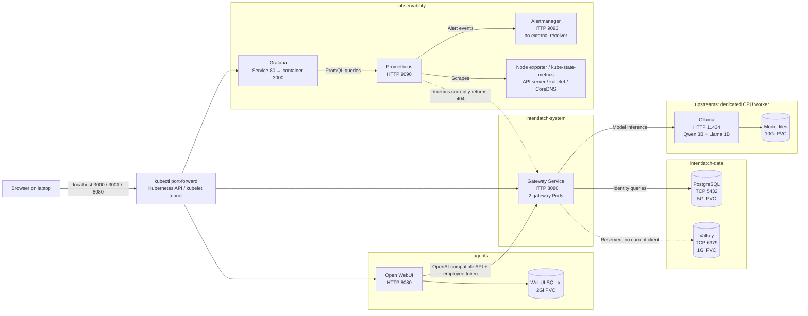
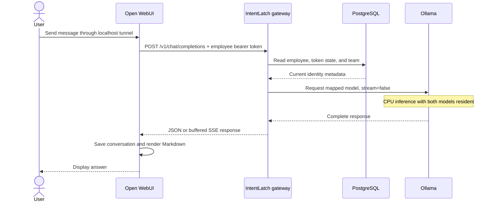
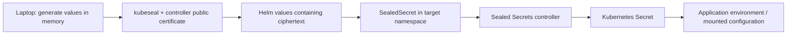

# IntentLatch Kubernetes cluster: resources and architecture

Verified against the running DigitalOcean cluster and installed Helm manifests
on **4 October 2026**, Europe/Sofia time, before public ingress was installed.

**Public access update:** Chat, Grafana, and the filtered model API now have a
persistent HTTPS edge. See [Public access](public-access.md) for the current
addresses, added resources, and certificate renewal. The counts, CSV inventory,
and private-only architecture below retain the original pre-ingress snapshot.

This is a snapshot of the deployed gateway image built from commit `b1b0289`.
The repository now also contains later policy-store, authority-policy pipeline,
and regex-policy commits through `dd33f31`. Those changes have not been deployed
to this cluster. Statements about missing gateway features below describe the
pinned image, not the newer source checkout. See [image-build.json](image-build.json)
for the deployed source commit and registry digest.

This guide explains the resources created for IntentLatch, their purpose, the
technologies they use, and their connections. The
[resource inventory](cluster-resource-inventory.csv) lists individual Kubernetes
objects, including generated children, with an owner and purpose for each row.
DigitalOcean's existing platform services are explained separately from the
resources installed by this project. No credential values are included.

The CSV contains 298 records covering the three releases, their generated
resources, and selected provider workloads, Services, storage objects, and CRDs.
It can be opened in a spreadsheet and filtered by namespace, kind, or origin.

## Contents

1. [What is running](#1-what-is-running)
2. [Architecture and request flow](#2-architecture-and-request-flow)
3. [Kubernetes resource types](#3-kubernetes-resource-types)
4. [Application resources](#4-application-resources)
5. [Monitoring resources](#5-monitoring-resources)
6. [Secrets and Kubernetes permissions](#6-secrets-and-kubernetes-permissions)
7. [Communication and network policies](#7-communication-and-network-policies)
8. [Storage and scheduling](#8-storage-and-scheduling)
9. [DigitalOcean platform resources](#9-digitalocean-platform-resources)
10. [Prepared resources and current limitations](#10-prepared-resources-and-current-limitations)
11. [Access, inspection, and source files](#11-access-inspection-and-source-files)

## 1. What is running

IntentLatch currently provides a private browser chat interface backed by an
authenticated gateway and two locally hosted language models. PostgreSQL stores
the gateway's teams and employee identities. A monitoring stack collects cluster
metrics. Sealed Secrets supplies application credentials.

| Property | Current installation |
| --- | --- |
| Kubernetes context | `do-fra1-hackyeah-cluster` |
| Provider and region | DigitalOcean Kubernetes, Frankfurt (`fra1`) |
| Workers | Three CPU-only workers, each with 4 vCPU and about 8 GB physical RAM |
| Worker software | Kubernetes kubelet `v1.36.3`, containerd `2.2.3`, Debian 13 |
| Allocatable resources per worker | `3890m` CPU and approximately `6414Mi` memory, after system reservations |
| Application/operator/monitoring pods | 15 at the inventory snapshot; DigitalOcean system pods are additional |
| Persistent application volumes | Six claims, all bound, totalling `24Gi` |
| Public application entry point | None; services are accessed using local port-forwards |
| Installation management | Helm from the laptop, driven by `deploy/Makefile` and Python scripts |

The installed releases contain **99 directly declared Kubernetes resources**.
Controllers additionally create Pods, ReplicaSets, EndpointSlices, Secrets,
volumes, and other supporting objects. CRDs are installed separately from the
ordinary Helm manifest. These distinctions explain why counting only the objects
in a chart does not give the total number of resources in the cluster.

### Releases and namespaces

| Helm release | Release namespace | Chart | Role |
| --- | --- | --- | --- |
| `intentlatch` | `default` | Local chart `intentlatch-0.1.0`, revision 16 | Application resources, policies, sealed credentials, dashboards, gateway monitoring |
| `monitoring` | `observability` | `kube-prometheus-stack-91.9.0`, revision 3 | Prometheus, Grafana, Alertmanager, exporters, monitoring operator |
| `sealed-secrets` | `sealed-secrets` | `sealed-secrets-2.20.0`, revision 1 | Controller that converts encrypted SealedSecrets into Kubernetes Secrets |

`default` holds the IntentLatch release record; the application's Pods run in
the dedicated namespaces below. A namespace is an administrative grouping,
not a separate machine or a network firewall by itself.

| Namespace | Purpose |
| --- | --- |
| `agents` | Open WebUI and its login/session/gateway credentials |
| `intentlatch-system` | Gateway replicas and their credentials |
| `intentlatch-data` | PostgreSQL and Valkey |
| `upstreams` | Ollama and its downloaded models |
| `observability` | Monitoring, dashboards, and alert evaluation |
| `sealed-secrets` | Secret-decryption controller and its sealing key |
| `kube-system` | Existing DigitalOcean networking, DNS, storage, and node services; also two monitoring discovery Services |
| `kube-public`, `kube-node-lease`, `default` | Standard Kubernetes namespaces; not additional IntentLatch applications |

The application chart creates the first five namespaces. The Sealed Secrets
installation creates its own namespace. DigitalOcean provided the standard
Kubernetes namespaces and worker infrastructure.

## 2. Architecture and request flow

Solid arrows below represent active connections. The dashed Valkey connection
is permitted by policy but is not used by the current gateway.



### What happens when someone sends a chat message

1. The browser connects to `http://localhost:3000`. The laptop's `kubectl`
   process tunnels the connection through Kubernetes to an Open WebUI Pod.
   No application load balancer is involved.
2. Open WebUI authenticates the browser user against its own local database.
   Its server submits the chat to
   `http://intentlatch-gateway.intentlatch-system.svc.cluster.local:8080/v1`.
3. WebUI adds the employee bearer token supplied by the `webui-employee`
   Secret. Both WebUI demo users currently share this gateway-side identity:
   employee `open-webui` in team `judges`. A WebUI login is therefore not a
   separate gateway employee identity.
4. The gateway verifies the signed token and queries PostgreSQL for the current
   employee, token identifier, revocation state, and team metadata.
5. The gateway translates `corporate-a` to `qwen2.5:3b`, or `corporate-b` to
   `llama3.2:1b`, and calls Ollama over the private Service on port `11434`.
6. Ollama runs the selected model on the dedicated CPU worker. Its model files
   come from its PVC; normal inference does not call a paid external LLM API.
7. The gateway receives the complete answer, then returns JSON or replays it
   as Server-Sent Events (SSE). It currently requests non-streaming generation
   from Ollama, so the user sees text after generation finishes.
8. Open WebUI renders the answer and saves the conversation to its own SQLite
   database. Chat messages are not stored in the gateway's PostgreSQL database
   by this version of the application.



## 3. Kubernetes resource types

These are the building blocks used by the deployment. A resource does not always
mean a running container: a Service, policy, dashboard ConfigMap, or CRD consumes
no dedicated Pod by itself.

| Type | What it does here |
| --- | --- |
| `Namespace` | Groups related application resources and provides a scope for names, permissions, and policies |
| `Deployment` | Maintains replaceable replicas, such as the gateway, WebUI, and Ollama |
| `ReplicaSet` | Created by a Deployment to maintain a particular revision's Pods; older zero-replica sets retain rollout history |
| `StatefulSet` | Maintains stable identities such as `postgres-0`, together with persistent storage; also used by the monitoring operator |
| `DaemonSet` | Runs a Pod on each eligible worker, for example node-exporter, Cilium, and the storage node plugin |
| `Pod` | Runs one application container or a group of cooperating containers, such as Prometheus plus its configuration reloader |
| `Service` | Gives a workload a stable DNS name and port while its Pods are replaced |
| Headless `Service` | Uses `clusterIP: None`; supports direct endpoint discovery and stable StatefulSet DNS, rather than a virtual Service IP |
| `EndpointSlice` / `Endpoints` | Records the actual addresses behind a Service; controllers update these when Pods change |
| `ConfigMap` | Stores non-secret configuration, initialization SQL, or dashboard JSON |
| `Secret` | Supplies sensitive configuration at runtime; base64 encoding itself is not encryption |
| `SealedSecret` | Stores ciphertext that the Sealed Secrets controller decrypts into a Secret |
| `PersistentVolumeClaim` (PVC) | A workload's request for durable disk space |
| `PersistentVolume` (PV) | Kubernetes' record of the provisioned DigitalOcean disk backing a claim |
| `StorageClass` / `CSIDriver` / `VolumeAttachment` | Define disk provisioning, identify the storage driver, and track attachment to a worker |
| `NetworkPolicy` | Allows selected pod-to-pod connections; Cilium enforces these rules |
| `PodDisruptionBudget` (PDB) | Limits voluntary disruptions; the gateway requires at least one available replica |
| `ServiceAccount` | Kubernetes identity for a Pod; distinct from WebUI accounts and gateway employees |
| `Role` / `ClusterRole` | Define Kubernetes API permissions within a namespace or at cluster scope |
| `RoleBinding` / `ClusterRoleBinding` | Grant those permissions to a ServiceAccount or other Kubernetes identity |
| `CustomResourceDefinition` (CRD) | Adds an API type, such as `Prometheus` or `SealedSecret`, for an operator to reconcile |
| `Prometheus`, `Alertmanager` | Operator inputs describing the monitoring servers to create |
| `ServiceMonitor` | Selects Services and tells Prometheus which metrics endpoints to scrape |
| `PrometheusRule` | Holds alerting or recording expressions evaluated by Prometheus |
| `ControllerRevision` | Stores revision history for StatefulSets and DaemonSets |
| `Job` | Runs finite maintenance work; the model download/warm-up Job is temporary and currently absent |

## 4. Application resources

### 4.1 Open WebUI: `agents`

**Purpose:** browser login, model selection, conversation storage, and displaying
the corporate models' responses.

| Resource | Purpose and connection |
| --- | --- |
| Deployment `open-webui` | One WebUI Pod using `ghcr.io/open-webui/open-webui:v0.11.4` |
| Service `open-webui` | Internal HTTP port `8080`; the laptop forwards port `3000` to it |
| PVC `open-webui` | `2Gi`, mounted at `/app/backend/data`; contains WebUI's SQLite database and local application data |
| SealedSecrets/Secrets `webui-auth`, `webui-employee`, `webui-accounts` | Session signing key, gateway employee token, and demo login credentials respectively |
| Policies `default-deny`, `allow-dns`, `open-webui` | Permit DNS and gateway access; block direct model/database access from this Pod |

WebUI uses its OpenAI-compatible connection to the gateway. Its direct Ollama
integration and user-configured direct connections are disabled. Signup is
disabled, login is required, and the judge account has explicit read access to
both corporate models. WebUI uses SQLite on its own disk, not the shared
PostgreSQL Service.

Automatic built-in tools are disabled for these two models. Automatic title,
tag, follow-up, and memory features are also disabled to avoid unnecessary CPU
inference. The models have a 256-token output default. These settings address
the previously observed long blank/loading state in browser chat.

The Deployment uses `Recreate`: its old Pod stops before its replacement starts,
which fits its single writable data volume. It is not a highly available UI.

### 4.2 Gateway: `intentlatch-system`

**Purpose:** authenticate model clients, manage teams and employees, expose
compatible model APIs, and route model aliases to Ollama.

| Resource | Purpose and connection |
| --- | --- |
| Deployment `intentlatch-gateway` | Two replicas, spread across the two general workers |
| Service `intentlatch-gateway` | Stable HTTP endpoint on `8080` for WebUI and private API clients |
| PDB `intentlatch-gateway` | `minAvailable: 1`; protects against voluntarily evicting both replicas together |
| SealedSecret/Secret `gateway-auth` | Database connection, token-signing key, and separate administrator API key |
| SealedSecret/Secret `gateway-valkey` | Prepared Valkey URL; currently not injected into the gateway |
| Policies `default-deny`, `allow-dns`, `gateway` | Permit selected clients and outgoing PostgreSQL, Ollama, and reserved Valkey connections |

The public GHCR image is
`ghcr.io/antonstwork/intentlatch-gateway:b1b0289e9412484816bb473e38eb73a3b4ccc7c7`.
It contains gateway source from commit `b1b0289`, built with Python 3.12.15.

| Technology | Gateway responsibility |
| --- | --- |
| FastAPI and Pydantic | HTTP routes and request/configuration validation |
| Uvicorn | Runs the ASGI application on port `8080` |
| HTTPX | Async HTTP requests to Ollama |
| Psycopg and connection pool | PostgreSQL queries and startup migrations |
| PyJWT, HS256 | Issue and verify signed employee identity tokens |
| Docker image / GHCR | Package and distribute the application |

Relevant routes are `/v1/models`, `/v1/chat/completions`, Ollama-compatible routes
under `/api`, `/authority`, `/admin`, and `/healthz`. Model endpoints require an
employee token; `/admin` uses the administrator API key. `/authority` reports
current database-backed identity and authorized-model metadata.

The current chat routes authenticate identity and validate the globally known
model aliases. They do **not yet enforce the team's `authorized_models` list
against the requested chat model**. The broader policy engine, budget controls,
regex rules, and control-agent checks described in the product vision are not
implemented by this deployed gateway. Deploying infrastructure does not add
those behaviors.

Gateway Pods run as non-root UID `10001`, with a read-only root filesystem,
dropped Linux capabilities, and a writable temporary volume. They do not mount
a Kubernetes ServiceAccount token. Readiness checks `/healthz`; that endpoint's
HTTP readiness result depends on PostgreSQL and separately reports Ollama's
status. TCP liveness avoids restarting every gateway during a database outage.
The Ollama request timeout is 180 seconds.

### 4.3 PostgreSQL: `intentlatch-data`

**Purpose:** durable gateway identity and team data.

| Resource | Purpose and connection |
| --- | --- |
| StatefulSet `postgres` | One `postgres-0` Pod using `postgres:17.10-bookworm` |
| Service `postgres` | Gateway's SQL endpoint on TCP `5432` |
| Service `postgres-headless` | Stable StatefulSet network identity |
| PVC `data-postgres-0` | `5Gi`, mounted under `/var/lib/postgresql/data` |
| ConfigMap `postgres-init` | Initialization SQL that creates role/database `intentlatch` on an empty data volume |
| SealedSecret/Secret `postgres-auth` | Separate database superuser and application passwords |
| NetworkPolicy `postgres` | Accepts application SQL traffic only from gateway-labeled Pods in `intentlatch-system` |

The application database contains `teams`, `employees`, and migration tracking.
The application role owns its database without being the PostgreSQL superuser.
Both gateway replicas share this database, so identities and revocations are
consistent across replicas. The gateway runs schema migrations at startup.

This is a plain PostgreSQL StatefulSet, not CloudNativePG. There is one database
instance, with no replication or scheduled backups. Changing a Kubernetes
password Secret alone does not change the password in an initialized database.

### 4.4 Valkey: `intentlatch-data`

**Purpose:** a Redis-compatible key-value service prepared for future counters,
caching, or rate/budget state. It is running but has no active gateway client.

| Resource | Purpose and connection |
| --- | --- |
| StatefulSet `valkey` | One `valkey-0` Pod using `valkey/valkey:8.1.10` |
| Service `valkey` | Authenticated Redis-protocol endpoint on TCP `6379` |
| Service `valkey-headless` | Stable StatefulSet identity |
| PVC `data-valkey-0` | `1Gi` mounted at `/data`, for append-only persistence |
| SealedSecret/Secret `valkey-auth` | Password supplied to the server and readiness CLI |
| NetworkPolicy `valkey` | Allows incoming gateway traffic, ready for future application use |

Append-only file persistence is enabled. The data-memory bound is `128mb` with
`noeviction`: the server does not silently evict existing keys when full.
The container memory limit is higher to allow process and persistence overhead.
The server's presence does not mean rate limiting or budgets are implemented.

### 4.5 Ollama: `upstreams`

**Purpose:** run the two corporate language models locally on CPU.

| Resource | Purpose and connection |
| --- | --- |
| Deployment `ollama` | One Pod using `ollama/ollama:0.35.1`, pinned to the dedicated worker |
| Service `ollama` | Private HTTP inference endpoint on `11434` |
| PVC `ollama` | `10Gi` mounted at `/root/.ollama`, storing model manifests and weights |
| Policies `default-deny`, `allow-dns`, `ollama` | Accept inference from gateway Pods; normal operation has no general Internet egress |

| Gateway/WebUI name | Actual Ollama model | Intended use |
| --- | --- | --- |
| `corporate-a` | `qwen2.5:3b` | Larger model, slower on the available CPU |
| `corporate-b` | `llama3.2:1b` | Smaller model, faster interactive demonstrations |

`OLLAMA_MAX_LOADED_MODELS=2` and `OLLAMA_KEEP_ALIVE=-1` keep both models resident.
`OLLAMA_NUM_PARALLEL=1` limits parallel inference within each model runner;
the deployment is sized for a light demo, not high concurrent chat load.
The context setting is 4096 tokens, and cloud functionality is disabled.

Ollama uses a `Recreate` strategy and has no replica on another worker. Its
readiness endpoint checks that the server responds; it does not prove that
every model is downloaded or that a generation will finish within the timeout.
The model warm-up and inference smoke tests provide that separate validation.

## 5. Monitoring resources

Monitoring is installed through `kube-prometheus-stack`. It runs independently
of the chat request path: a Grafana outage does not prevent model inference.

### Servers and exporters

| Resource | Technology | Purpose |
| --- | --- | --- |
| Deployment `monitoring-operator` | Prometheus Operator `v0.94.1` | Watches monitoring CRs and creates/reconciles the actual servers and configurations |
| CR `Prometheus/monitoring-prometheus` | Prometheus Operator API | Declares one metrics server, retention, storage, and monitor/rule selection |
| StatefulSet `prometheus-monitoring-prometheus` | Prometheus `v3.15.0-distroless` | Scrapes metrics, stores time series, evaluates PromQL and alert rules |
| CR `Alertmanager/monitoring-alertmanager` | Prometheus Operator API | Declares the alert routing server |
| StatefulSet `alertmanager-monitoring-alertmanager` | Alertmanager `v0.34.1` | Groups and deduplicates alerts; its current null receiver sends no external notifications |
| Deployment `monitoring-grafana` | Grafana `13.2.3-distroless` | Authenticated browser dashboards querying Prometheus |
| Grafana sidecar container | `k8s-sidecar:2.11.2` | Watches labeled dashboard ConfigMaps in `observability` and provisions their JSON into Grafana |
| Deployment `monitoring-kube-state-metrics` | kube-state-metrics `v2.20.0` | Converts Kubernetes object state into metrics, such as desired versus ready replicas |
| DaemonSet `monitoring-prometheus-node-exporter` | node-exporter `v1.12.1-distroless` | One Pod per worker exporting host CPU, memory, filesystem, and other OS metrics |
| Prometheus/Alertmanager reloader containers | Config reloader `v0.94.1` | Notice generated configuration changes and request server reloads |

Prometheus retains up to two days of metrics, with a `4GB` size bound on its
`5Gi` PVC. Grafana has a `1Gi` PVC for its database and application state.
Alertmanager has no PVC, so its local runtime state is not durable across Pod
replacement. There is only one replica of each of these monitoring servers.

### Services

| Namespace / Service | Port(s) | Purpose |
| --- | --- | --- |
| `observability/monitoring-grafana` | `80` → container `3000` | Browser UI and Grafana metrics; forwarded as laptop port `3001` |
| `observability/monitoring-prometheus` | `9090`, reloader `8080` | Query/scrape API and reloader metrics |
| `observability/prometheus-operated` | `9090`, headless | Operator-created discovery for Prometheus Pods |
| `observability/monitoring-alertmanager` | `9093`, reloader `8080` | Alert API/UI and reloader metrics |
| `observability/alertmanager-operated` | `9093`, TCP/UDP `9094`, headless | Operator discovery and Alertmanager peer-mesh endpoints; currently only one peer |
| `observability/monitoring-operator` | `8080` | Operator's own metrics; its separate TLS/admission configuration is disabled |
| `observability/monitoring-kube-state-metrics` | `8080` | Kubernetes object-state metrics |
| `observability/monitoring-prometheus-node-exporter` | `9100` | Discovery of each worker's exporter |
| `kube-system/monitoring-coredns` | `9153` | Scrapes existing CoreDNS Pods without changing normal DNS traffic |
| `kube-system/monitoring-kubelet` | `10250`, plus declared legacy `4194`/`10255` ports | Operator-created node discovery; configured scrapes use HTTPS `10250` |

Grafana queries
`http://monitoring-prometheus.observability.svc.cluster.local:9090` from its
server. The user's browser does not need direct Prometheus access.

### Metrics discovery and alerts

All ten ServiceMonitors are in `observability`:

| ServiceMonitor | What it collects |
| --- | --- |
| `intentlatch-gateway` | Attempts `/metrics` on each gateway replica; currently returns `404` |
| `monitoring-apiserver` | Kubernetes API server metrics through the existing `default/kubernetes` Service |
| `monitoring-kubelet` | HTTPS `/metrics`, `/metrics/cadvisor`, and `/metrics/probes` from worker kubelets |
| `monitoring-coredns` | DNS server metrics |
| `monitoring-grafana` | Grafana process metrics |
| `monitoring-kube-state-metrics` | Kubernetes workload/object state |
| `monitoring-prometheus-node-exporter` | Worker OS metrics |
| `monitoring-prometheus` | Prometheus and its reloader |
| `monitoring-alertmanager` | Alertmanager and its reloader |
| `monitoring-operator` | Prometheus Operator metrics |

The `PrometheusRule/intentlatch` resource contains gateway, Ollama, and
PostgreSQL availability alerts based on Kubernetes readiness metrics. It also
contains future team-budget alerts; those cannot evaluate meaningfully until
the application emits `intentlatch_team_token_usage_ratio`.

Prometheus evaluates rules every 30 seconds and scrapes most targets every
30 seconds. The gateway ServiceMonitor also uses a 30-second interval.
Configured alerts go to Alertmanager, whose `null` receiver deliberately has
no Slack, Discord, email, or other external destination.

### Dashboard and configuration resources

| ConfigMap | Purpose |
| --- | --- |
| `intentlatch-executive` | Dashboard definitions for request outcomes, team token usage, tokens, compute time, and active policies |
| `intentlatch-security` | Dashboard definitions for policy enforcement, authentication failures, and control-agent outcomes |
| `intentlatch-performance` | Dashboard definitions for model request rates, latency, upstream errors, tests, and gateway scrape health |
| `monitoring-grafana` | Grafana server configuration and provisioned Prometheus data source |
| `monitoring-grafana-config-dashboards` | Grafana dashboard-provider configuration |
| `prometheus-monitoring-prometheus-rulefiles-0` | Operator-generated rule files compiled from selected PrometheusRule resources |

The three IntentLatch dashboards are installed, but most application panels
have no data because the gateway has no `/metrics` implementation yet.
Infrastructure metrics work separately. The performance dashboard's gateway
scrape-health panel can show a failed scrape; it is not proof that chat is down.

Loki and Tempo are not installed. Logs remain container logs inspected with
`kubectl logs`; this stack does not provide a central application log archive
or distributed tracing backend.

## 6. Secrets and Kubernetes permissions

### Sealed Secrets controller

Deployment `sealed-secrets`, using controller `0.40.0`, watches `SealedSecret`
objects and creates ordinary Secrets in their respective namespaces. Its
Service `sealed-secrets:8080` supports controller/public-certificate access.
Service `sealed-secrets-metrics:8081` exposes controller metrics, but no
ServiceMonitor for that endpoint is installed by this setup.



Ciphertext is bound to the Secret's exact name and namespace. The controller's
private sealing key is itself a Secret in `sealed-secrets`, currently named
`sealed-secrets-keynks99`. Application Pods receive the resulting Secret values
through Kubernetes; they do not perform decryption or call the controller.

### The eight application SealedSecret/Secret pairs

Each row represents two objects with the same namespace and name: encrypted
`SealedSecret` input and decrypted `Secret` output.

| Namespace / name | Contains, without revealing values | Consumer |
| --- | --- | --- |
| `intentlatch-data/postgres-auth` | Superuser password and application password | PostgreSQL initialization |
| `intentlatch-system/gateway-auth` | PostgreSQL connection URL, employee-token signing key, administrator API key | Gateway |
| `intentlatch-data/valkey-auth` | Valkey password | Valkey server/readiness CLI |
| `intentlatch-system/gateway-valkey` | Prepared authenticated Valkey URL | Reserved; no current gateway consumer |
| `agents/webui-auth` | WebUI session/signing secret | WebUI |
| `agents/webui-employee` | Employee token under the OpenAI-compatible key name `OPENAI_API_KEY` | WebUI's gateway connection |
| `agents/webui-accounts` | Admin/judge email addresses and generated passwords | Login bootstrap and authorized local credential retrieval |
| `observability/grafana-auth` | Grafana administrator username/password | Grafana |

The name `OPENAI_API_KEY` identifies a configuration slot in WebUI. Its value
here is an IntentLatch employee token, not a credential for a paid OpenAI service.

Monitoring also creates Secrets for Alertmanager configuration, generated
Prometheus configuration, API authentication, and operator-managed TLS/web
configuration assets. These are listed individually in the inventory. A Secret
whose name contains `thanos` or `tls` does not by itself mean that a Thanos
server or public HTTPS ingress has been deployed.

Helm stores release history in Secrets named `sh.helm.release.v1.<release>.vN`.
These are installation/rollback records, not additional applications. At this
snapshot there are ten retained IntentLatch revisions, three monitoring
revisions, and one Sealed Secrets revision.

### ServiceAccounts and RBAC

The application workloads use their namespace's `default` ServiceAccount but
set `automountServiceAccountToken: false`. They do not need to call the
Kubernetes API for normal chat, SQL, or model inference.

Controllers and monitoring components do need API access:

| Identity and permission resources | Purpose |
| --- | --- |
| SA `monitoring-operator`; ClusterRole/Binding `monitoring-operator` | Reconcile monitoring CRs, server workloads, Services, and generated configuration |
| SA `monitoring-prometheus`; ClusterRole/Binding `monitoring-prometheus` | Discover scrape targets and access permitted Kubernetes metrics endpoints |
| SA `monitoring-kube-state-metrics`; ClusterRole/Binding of the same name | Read object state and expose it as metrics |
| SA `monitoring-grafana`; ClusterRole `monitoring-grafana-clusterrole`; Binding `monitoring-grafana-clusterrolebinding` | Allow the sidecar to discover dashboard/configuration objects; its configured watch namespace is `observability` |
| SAs `monitoring-alertmanager`, `monitoring-prometheus-node-exporter` | Workload identities supplied by the chart; no corresponding dedicated ClusterRole/Binding is created here |
| SA `sealed-secrets`; ClusterRole `secrets-unsealer`; ClusterRoleBinding `sealed-secrets` | Watch sealed inputs and reconcile output Secrets across namespaces |
| Role/Binding `sealed-secrets-key-admin` | Manage the controller's sealing-key Secrets in its namespace |
| Role/Binding `sealed-secrets-service-proxier` | Allow the controller service-proxy access needed by the sealing workflow |

Each namespace also has a Kubernetes-generated `kube-root-ca.crt` ConfigMap
containing the API server trust certificate. Its presence is normal and is not
an application TLS certificate or a password.

### Custom resource definitions

The installation uses `sealedsecrets.bitnami.com` and the following ten
Prometheus Operator CRDs:

| CRD, under `monitoring.coreos.com` | Current use |
| --- | --- |
| `prometheuses` | One Prometheus server definition |
| `alertmanagers` | One Alertmanager definition |
| `servicemonitors` | Ten scrape-discovery definitions |
| `prometheusrules` | One application rule resource |
| `alertmanagerconfigs` | Available API type; no instances in this installation |
| `podmonitors` | Available direct-Pod scrape API; no instances |
| `probes` | Available blackbox-probe API; no instances |
| `prometheusagents` | Available forwarding-agent API; no instances |
| `scrapeconfigs` | Available additional scrape-configuration API; no instances |
| `thanosrulers` | Available Thanos rule-evaluation API; no instances |

A CRD adds an API type. An operator and a custom resource instance are needed
to turn that capability into a running workload.

## 7. Communication and network policies

Service DNS follows `<service>.<namespace>.svc.cluster.local`. Applications
should use these stable names, not a particular Pod IP or generated Pod name.
CoreDNS resolves them. Kubernetes/Cilium routes Service traffic to eligible
endpoints. No service mesh or inter-service mTLS layer is installed; the
application HTTP connections inside the cluster are plain HTTP.

### Connection matrix

| Source | Destination | Protocol / port | Status and purpose |
| --- | --- | --- | --- |
| Browser | Laptop port-forward | HTTP `3000`, `3001`, `8080` | Local UI, Grafana, and gateway access |
| Laptop `kubectl` | Kubernetes API / selected Pod | Authenticated Kubernetes tunnel | Uses kubeconfig; not a public application route |
| WebUI | `intentlatch-gateway.intentlatch-system` | HTTP `8080` | Active chat/model-list connection with employee bearer authentication |
| Gateway | `postgres.intentlatch-data` | PostgreSQL TCP `5432` | Active identity/team queries and migrations |
| Gateway | `ollama.upstreams` | HTTP `11434` | Active inference and health requests |
| Gateway | `valkey.intentlatch-data` | Redis protocol TCP `6379` | Allowed but unused by current gateway code |
| Application Pods | CoreDNS in `kube-system` | UDP/TCP `53` | Service-name resolution |
| Grafana | `monitoring-prometheus.observability` | HTTP `9090` | Dashboard queries |
| Prometheus | Services selected by ServiceMonitors | Mostly HTTP; API/kubelet use HTTPS | Metrics collection; exact targets are listed above |
| Prometheus | `monitoring-alertmanager.observability` | HTTP `9093` | Send firing/resolved alerts |
| Operators/exporters/Grafana sidecar | Kubernetes API | HTTPS `443` via in-cluster Service | Watch/read/reconcile resources according to RBAC |
| Model pull Job | Ollama | HTTP `11434` | Temporary maintenance flow, currently absent |
| Ollama | Public model registries | HTTPS `443` | Temporary download exception only; currently closed |

The four application namespaces have both ingress and egress default denies.
Policies are additive: the named allow rules permit specific flows through those
denies. DNS is allowed separately.

| Policy | Namespace(s) | Purpose |
| --- | --- | --- |
| `default-deny` | `agents`, `intentlatch-system`, `intentlatch-data`, `upstreams` | Start with no permitted application ingress/egress |
| `allow-dns` | Same four namespaces | Permit DNS queries to CoreDNS |
| `gateway` | `intentlatch-system` | Allow WebUI and Prometheus clients, future Envoy namespace clients, and outgoing PostgreSQL/Valkey/Ollama calls |
| `open-webui` | `agents` | Permit outgoing gateway access and incoming traffic from the future Envoy namespace |
| `postgres` | `intentlatch-data` | Permit gateway SQL connections |
| `valkey` | `intentlatch-data` | Permit future gateway key-value connections |
| `ollama` | `upstreams` | Permit inference from gateway Pods |
| `grafana-ingress` | `observability` | Permit Prometheus scraping and future Envoy access to Grafana's container port `3000` |

This totals **14 NetworkPolicies**. `observability` has no blanket egress deny
because its discovery and control processes need the Kubernetes API and multiple
scrape targets. The `sealed-secrets` namespace has no application network policy
in this chart.

WebUI cannot directly reach Ollama, PostgreSQL, or Valkey through normal Pod
network traffic. That restriction was tested against both Ollama DNS and Service
IP. Kubernetes administrators with suitable `exec` or `port-forward` privileges
still have administrative access; NetworkPolicy is not a replacement for RBAC.

Rules that mention `envoy-gateway-system` reserve a future path. They do not
create an Envoy Pod or expose a port to the Internet today.

## 8. Storage and scheduling

### Persistent volumes

| Namespace / PVC | Size | Data | Mounted location |
| --- | ---: | --- | --- |
| `agents/open-webui` | `2Gi` | WebUI accounts, chats, model settings, local application files | `/app/backend/data` |
| `intentlatch-data/data-postgres-0` | `5Gi` | Gateway teams, employees, migration state | `/var/lib/postgresql/data` |
| `intentlatch-data/data-valkey-0` | `1Gi` | Valkey append-only persistence | `/data` |
| `upstreams/ollama` | `10Gi` | Downloaded model weights and manifests | `/root/.ollama` |
| `observability/monitoring-grafana` | `1Gi` | Grafana database and local state | `/var/lib/grafana` |
| `observability/prometheus-monitoring-prometheus-db-prometheus-monitoring-prometheus-0` | `5Gi` | Prometheus time-series database | `/prometheus` |

All use `do-block-storage`, backed by CSI driver `dobs.csi.digitalocean.com`.
Its binding mode is `Immediate`, it supports expansion, and its reclaim policy
is `Delete`. Deleting a claim can therefore delete the backing cloud disk;
Pod replacement alone does not delete the claim or its data.

Each claim has a generated `pvc-...` PV and a CSI VolumeAttachment recording
which worker holds the disk. All six claims are `ReadWriteOnce`, meaning they
can be mounted read-write by one node at a time. This does not mean a volume
is an automatic backup or a replicated database.

DigitalOcean also provides `do-block-storage-retain`,
`do-block-storage-xfs`, and `do-block-storage-xfs-retain`. These alternative
StorageClasses are available but none of the six current claims uses them.

Gateway temporary files, Ollama scratch files, Valkey's generated configuration,
and PostgreSQL runtime sockets use `emptyDir` volumes. These disappear with the
Pod. Dashboard ConfigMaps and generated configuration mounts are separate from
durable application disks.

### Worker placement

| Worker | Role | Why |
| --- | --- | --- |
| `pool-d5e2gdbur-3x1f37` | Dedicated Ollama worker | Keeps model memory and CPU separate from the general applications |
| `pool-d5e2gdbur-3x1f3m` | General worker | Gateway replica, data/UI/operator workloads according to scheduler decisions |
| `pool-d5e2gdbur-3x1f3q` | General worker | Second gateway replica and general/monitoring workloads |

The Ollama worker has label `intentlatch.io/role=ollama` and a matching
`NoSchedule` taint. Ollama explicitly selects and tolerates it. Ordinary
applications require nodes without that role. Node-exporter and DigitalOcean
system agents still run on the dedicated worker because they monitor/support it.

Gateway topology-spread constraints place its two replicas on different general
workers. Its rolling strategy allows one extra Pod and zero unavailable Pods
during a normal rollout, subject to available capacity. The PDB protects
voluntary disruptions; it cannot prevent a node failure or make PostgreSQL and
Ollama redundant.

CPU and memory requests reserve scheduling capacity; limits cap container usage.
For example, Ollama requests 2 CPUs/4Gi and is limited to 3 CPUs/4608Mi. CPU
limits may cause throttling; exceeding a memory limit can terminate a container.
See [the resource budget](resource-budget.md) for every workload and sidecar.

## 9. DigitalOcean platform resources

These services already supported the DOKS cluster before IntentLatch was
installed. They are dependencies of the application, not additional corporate
LLMs or Helm application releases.

| Resource family in `kube-system` | Technology and purpose |
| --- | --- |
| Deployment `coredns`; Service `kube-dns` | CoreDNS `1.14.2`; resolves Kubernetes Service names on UDP/TCP `53` |
| DaemonSet `cilium` | Cilium `v1.19.3`; supplies pod networking, Service routing integration, and NetworkPolicy enforcement; includes a node-readiness helper |
| Deployments `hubble-relay`, `hubble-ui`; Services `hubble-peer`, `hubble-relay`, `hubble-ui`, `hubble-metrics` | Cilium/Hubble network-flow observability; relay `v1.19.3`, UI `v0.13.2`; separate from the application's Grafana dashboards |
| Service `cilium-agent` | Exposes Cilium-associated proxy metrics; it is not the prepared IntentLatch Envoy ingress |
| DaemonSet `csi-do-node` | DigitalOcean CSI node plugin `v4.18.0` and registration sidecar; attach/mount block storage on workers |
| DaemonSet `do-node-agent` | DigitalOcean node agent `3.18.12`; sends node telemetry to the provider |
| DaemonSet `doks-telemetry-config-reloader` | Refreshes provider telemetry configuration |
| Deployment `konnectivity-agent` | Kubernetes network proxy agent `v0.34.0`; supports managed-control-plane connectivity to workers |
| DaemonSets `do-node-agent-amd-device-metrics-exporter`, `do-node-agent-nvidia-dcgm-exporter` | Provider-supplied GPU telemetry definitions; both have zero scheduled Pods on these CPU-only workers |

Provider ConfigMaps configure DNS, Cilium, Hubble, telemetry, and control-plane
integration. Provider ServiceAccounts, Roles, and ClusterRoles let those agents
perform their jobs. They are not application login accounts. The Kubernetes
API server, scheduler, and core controller manager are managed by DigitalOcean;
they are not extra application Pods on the three workers listed above.

The cluster already has Cilium, storage snapshot, and Gateway API CRDs. A
provider GatewayClass exists, but there are no Gateway or HTTPRoute instances
for this application. Existing API types do not mean our prepared public edge
has been installed. Snapshot CRDs likewise do not mean application backups
are configured.

The Kubernetes Metrics API (`metrics-server`) is absent in this installation.
Prometheus still scrapes its own targets; `kubectl top` and Grafana/Prometheus
metrics are different mechanisms.

## 10. Prepared resources and current limitations

### Temporary maintenance resources

`Job/ollama-pull` downloads and warms both models when `make models` is run.
It receives temporary policies `ollama-pull-ingress`, `ollama-pull-egress`, and
`ollama-download`. The Job invokes Ollama's API, and the Ollama server downloads
the files to its PVC. The deployment script removes the Job/permissions after
the maintenance stage. None of these temporary resources is currently active.

The network-policy smoke test also creates a short-lived test Pod and removes
it after checking allowed gateway access and denied direct Ollama access.

### Public edge prepared in source, not installed

| Prepared component/resource | Purpose if enabled |
| --- | --- |
| Envoy Gateway chart `v1.9.2` | Controller for Kubernetes Gateway API resources |
| `EnvoyProxy/intentlatch` | Configures two Envoy proxy replicas and one DigitalOcean LoadBalancer Service |
| `GatewayClass/intentlatch`, `Gateway/intentlatch` | Define the controller and HTTP/HTTPS listeners |
| HTTPRoutes `api`, `chat`, `grafana`, `https-redirect` | Route hostnames to existing internal Services and redirect HTTP to HTTPS |
| `ClientTrafficPolicy/intentlatch` | Configure downstream connection and 360-second HTTP timeouts |
| `BackendTrafficPolicy/api-body-limit` | Limit buffered API request bodies to `1Mi` |
| cert-manager chart `v1.21.2` | Issue and renew certificates |
| ClusterIssuers `letsencrypt-staging`, `letsencrypt-production` | ACME issuer definitions |
| `Certificate/intentlatch-edge` and generated TLS Secret | TLS for `api`, `chat`, and `grafana` hostnames under a future domain |

There is no domain selected, no IntentLatch public LoadBalancer, and no
application TLS certificate. There is also no deployed management-console
workload or `console` route. The selected setup omits Argo CD, CloudNativePG,
Loki, Tempo, and external alert notifications.

### What the current installation does and does not provide

| Area | Current state |
| --- | --- |
| Corporate chat | Both models work through WebUI and the gateway; short browser tests displayed formatted answers and survived reload |
| Streaming display | Gateway buffers complete upstream answers before SSE replay; no token-by-token display during inference |
| Identity | Signed employee tokens with database-backed validation/revocation; shared gateway identity for WebUI demo users |
| Policy enforcement | Full policy/budget/regex/control-agent behavior is not implemented; team model metadata is reported but not enforced by chat routes |
| Valkey integration | Server provisioned; gateway connection not implemented |
| Application metrics | Gateway `/metrics` returns 404; dashboard and future-budget definitions are scaffolding |
| Cluster metrics | Prometheus infrastructure collection is configured independently of gateway metrics |
| WebUI title callback | Version `0.11.4` still logs a nonblocking `KeyError: 'model'`; disabling title inference removes extra model calls but not that callback |
| Document retrieval/RAG | Offline embedding model is not cached; retrieval is not ready or validated |
| Availability | Two gateway replicas, but single PostgreSQL, Ollama, WebUI, Valkey, and monitoring instances |
| Data protection | Persistent disks survive Pod replacement; no scheduled database/disk backups are configured |
| Logs/traces | Container logs available through Kubernetes; no central Loki/Tempo deployment |

The [live validation report](live-validation.md) records tested behavior and the
browser performance correction in more detail.

## 11. Access, inspection, and source files

### Local access

| Interface | Address | Authentication |
| --- | --- | --- |
| Chat | <http://localhost:3000> | WebUI judge or administrator login |
| Grafana | <http://localhost:3001> | Grafana administrator login |
| Gateway health | <http://localhost:8080/healthz> | No application credential required for health |
| Gateway model APIs | `http://localhost:8080/v1` | Employee bearer token |
| Gateway administration | `http://localhost:8080/admin` | Administrator API key |

The local addresses work while the forwarding helper is running on the laptop.
It reconnects after Pod replacements or network interruptions. To start it
when no existing helper owns those ports, run from the repository root:

```bash
export KUBECONFIG="$PWD/../hackyeah-cluster-kubeconfig.yaml"
make -C deploy access
```

Credentials are deliberately not copied into this guide. Their Secret names,
purposes, and consumers are listed in section 6. Authorized retrieval commands
are in [the live access instructions](live-validation.md#access).

### Read-only inspection

```bash
kubectl --context do-fra1-hackyeah-cluster get nodes
kubectl --context do-fra1-hackyeah-cluster get pods -A -o wide
kubectl --context do-fra1-hackyeah-cluster get deploy,sts,ds,svc,pvc -A
kubectl --context do-fra1-hackyeah-cluster get networkpolicies -A
kubectl --context do-fra1-hackyeah-cluster get sealedsecrets -A
kubectl --context do-fra1-hackyeah-cluster -n observability get prometheus,alertmanager,servicemonitor,prometheusrule
helm --kube-context do-fra1-hackyeah-cluster list -A
```

These show state or metadata; they do not decode Secret values. Pod names,
ReplicaSet hashes, EndpointSlices, attachment names, and Helm revisions will
change during future rollouts. Use stable controller and Service names for
normal operations. `kubectl get all` does not include every resource type,
which is why the inventory also covers storage, policies, RBAC, CRDs, and Secrets.

### Where the architecture is defined

| Source | What it controls |
| --- | --- |
| [Application Helm templates](helm/intentlatch/templates/) | Workloads, Services, volumes, policies, sealed inputs, monitoring definitions, optional edge |
| [Application values](helm/intentlatch/values.yaml) | Image pins, resources, storage, feature defaults |
| [Monitoring values](third-party/monitoring.yaml) | Metrics stack, retention, Grafana provisioning, alert routing |
| [Sealed Secrets values](third-party/sealed-secrets.yaml) | Controller image, scheduling, resources |
| [Third-party versions](third-party/versions.env) | Helm chart and tooling pins |
| [WebUI bootstrap](scripts/bootstrap-webui.py) | Accounts, model grants, built-in-tool setting, output defaults |
| [Access helper](scripts/access.py) | The three localhost tunnels and reconnection |
| [Deployment guide](README.md) | Installation sequence, maintenance, validation, teardown |
| [Resource budget](resource-budget.md) | Requests, limits, and node-capacity assumptions |
| [Gateway source](../gateway/src/intentlatch/) | Current implementation; use the commit in `image-build.json` when comparing with this deployed snapshot |
| [Object inventory](cluster-resource-inventory.csv) | Resource names, purpose, ownership, connections, and storage/placement snapshot |

The guide was built from live read-only Kubernetes queries, the three installed
Helm manifests, deployment configuration, and the source corresponding to the
published gateway image. Writing this documentation made no changes to the
running cluster.
