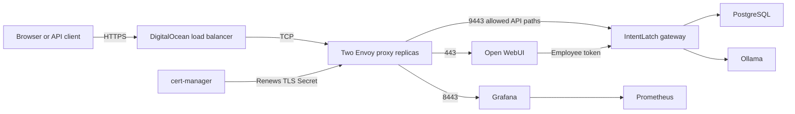

# Public HTTPS access

The public entry point runs inside the DigitalOcean cluster. It works when the
laptop is disconnected, with one load balancer shared by all three services.

| Service | HTTPS address | Login |
| --- | --- | --- |
| Chat | `https://146.190.179.204/` | Existing WebUI account, such as `judge@intentlatch.example` |
| Grafana | `https://146.190.179.204:8443/` | Existing Grafana administrator account |
| Model API | `https://146.190.179.204:9443/v1` | IntentLatch employee bearer token |

Use the same passwords as the localhost deployment. Public registration is
disabled. Login credentials remain in Kubernetes Secrets `agents/webui-accounts`
and `observability/grafana-auth`; they are not included in this document or Git.
The gateway administrator API remains available through the private localhost
port-forward on port 8080.

Chat offers `corporate-a` (Qwen 2.5 3B) and `corporate-b` (Llama 3.2 1B).
The API is OpenAI-compatible. Its Ollama-compatible endpoints remain under
`https://146.190.179.204:9443/api`. Model requests require an employee token.
The API routes `/admin`, `/metrics`, `/docs`, and `/openapi.json` return 404 at
the public proxy. PostgreSQL, Valkey, and Ollama have no public listener.

## Request path and resources



The port labels above identify public listeners. Backend connections use the
existing internal Service ports: WebUI/gateway 8080 and Grafana 80, whose Pod
port is 3000. NetworkPolicies retain the existing isolation boundaries.

| Resource | Purpose |
| --- | --- |
| Helm release `eg`, namespace `envoy-gateway-system` | Envoy Gateway v1.9.2 controller reconciles Gateway API configuration |
| `GatewayClass/intentlatch` | Selects the Envoy Gateway controller |
| `EnvoyProxy/intentlatch` | Two proxy replicas on general workers, image pinned to Envoy v1.39.1 and its digest; one regional load-balancer Service |
| `Gateway/intentlatch` | HTTP port 80 plus TLS listeners for Chat, Grafana, and the model API |
| `HTTPRoute/https-redirect` | Redirects ordinary HTTP requests to HTTPS on port 443 |
| `HTTPRoute/chat`, `grafana`, `api` | Connect each HTTPS listener to its internal Service; API has an explicit path allowlist |
| `ClientTrafficPolicy/intentlatch` | 360-second downstream request/idle timeouts |
| `BackendTrafficPolicy/api-body-limit` | Rejects model API request bodies over 1 MiB with 413 |
| Helm release `cert-manager`, namespace `cert-manager` | Certificate controller, admission webhook, and CA injector, pinned to v1.21.2 |
| `ClusterIssuer/letsencrypt-staging` and `letsencrypt-production` | ACME issuers using the `shortlived` certificate profile |
| `Certificate/intentlatch-edge` | Requests a certificate with the public IP as its IP address SAN |
| Secret `envoy-gateway-system/intentlatch-edge-tls` | Generated TLS certificate/private key consumed by Envoy; rotated by cert-manager |
| Temporary HTTP-01 Pod, Service, HTTPRoute, Order, and Challenge | Prove control of the public IP during issuance and renewal; solver resources are removed afterward |

The proxy terminates TLS; the DigitalOcean load balancer forwards TCP.
No wildcard DNS service or self-signed production certificate is involved.
The original gateway application image remains unchanged.

## Certificates and ongoing operation

Let's Encrypt IP certificates last 160 hours. cert-manager starts renewal
48 hours before expiry and rotates the private key. Keep HTTP port 80 reachable
for ACME validation; it exposes only challenge responses and HTTPS redirection.
[Let's Encrypt documentation](https://letsencrypt.org/2026/01/15/6day-and-ip-general-availability).

```bash
export KUBECONFIG=/home/antonstankov/hackyeah/hackyeah-cluster-kubeconfig.yaml
kubectl --context do-fra1-hackyeah-cluster -n envoy-gateway-system get gateway,svc,certificate
kubectl --context do-fra1-hackyeah-cluster -n envoy-gateway-system describe certificate intentlatch-edge
make -C deploy smoke SMOKE_ARGS='--public-ip 146.190.179.204 --port 0'
```

The IP stays assigned for the lifetime of the load-balancer Service. If that
Service is recreated, `make -C deploy edge` discovers the current IP, saves it
in the ignored `site-values.yaml`, and requests a matching certificate.
Staging is used for initial validation; production uses `letsencrypt-production`.

This adds one size-1 regional load balancer, currently **$12/month**, prorated
by hours, in addition to existing workers and disks.
[DigitalOcean pricing](https://docs.digitalocean.com/products/networking/load-balancers/details/pricing/).

`make -C deploy destroy` removes the entire IntentLatch installation, including
the public entry point and application volumes. Use it only when ending the
deployment. Six pre-existing DigitalOcean Gateway API CRDs are preserved; they
were upgraded to the compatible v1.6.1 bundle while retaining `TLSRoute/v1alpha2`
for Cilium. Their original definitions are backed up in ignored local state.

The [cluster guide](cluster-guide.md) and [CSV inventory](cluster-resource-inventory.csv)
describe the earlier private installation. This document records the public
edge added afterward; see [deployment instructions](README.md#6-enable-the-public-edge)
for the reproducible IP and domain workflows.
